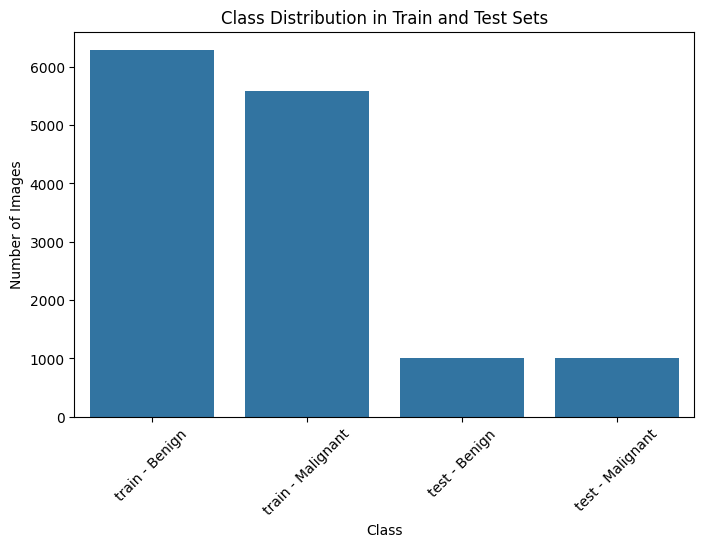
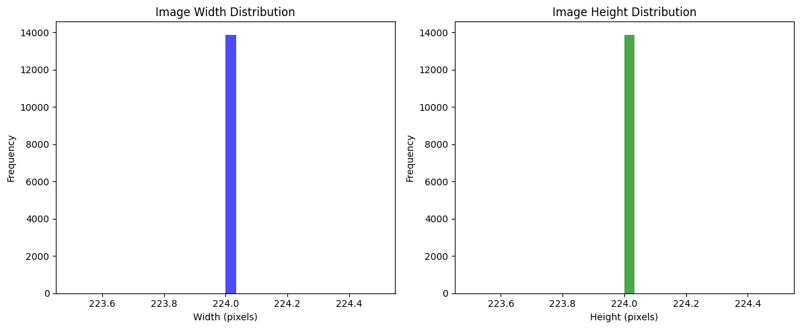
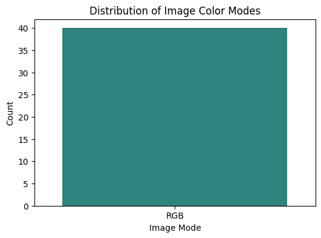
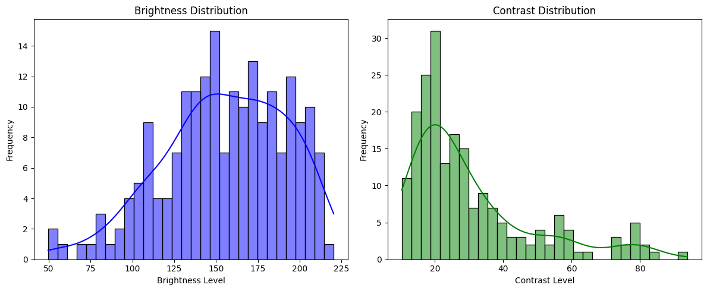
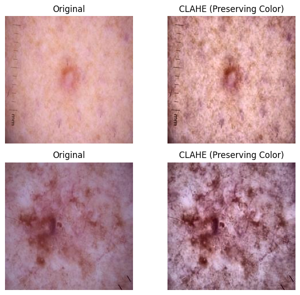
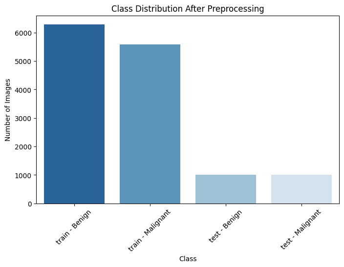
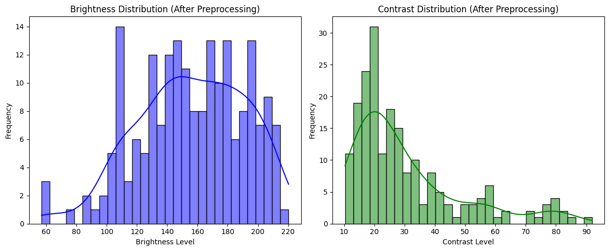
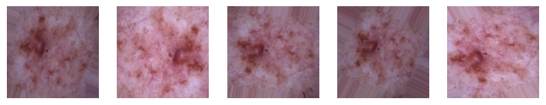
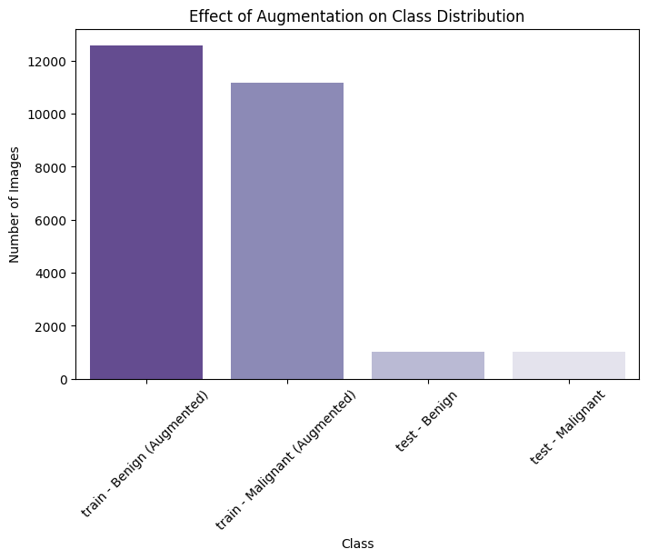

Here is your `EDA.md` file:

---

# **Exploratory Data Analysis (EDA) for Skin Cancer Classification**

## **Overview**
This document provides an overview of the exploratory data analysis (EDA) performed on the skin cancer classification dataset. The goal is to understand the dataset's structure, assess the quality of the images, and prepare them for model training. We also analyze class distributions, image properties, and the impact of preprocessing and augmentation steps.

---

## **1. Dataset Structure**
The dataset consists of **13,879 images**, categorized into two classes: benign and malignant. The images are divided into training and test sets.

- **Training Set:** 11,879 images  
  - Benign: 6,289 images  
  - Malignant: 5,590 images  
- **Test Set:** 2,000 images  
  - Benign: 1,000 images  
  - Malignant: 1,000 images  

### **Observations:**
- The test set is balanced, ensuring fair model evaluation.
- The training set has a slight imbalance, which may need to be addressed.

---

## **2. Image Properties**
### **2.1 Image Dimensions**
All images have a resolution of **224×224 pixels**, which means no resizing is required.

### **2.2 Image Color Analysis**
All images are in **RGB format**, ensuring that color information is preserved for model training.

---

## **3. Brightness and Contrast Analysis**
Some images have **low brightness and contrast**, which can impact the model’s ability to learn features effectively.

### **Observations:**
- Some images are too dark or too bright.
- The contrast levels are inconsistent, which could affect lesion detection.

To address these issues, **contrast-limited adaptive histogram equalization (CLAHE)** was applied to improve visibility while preserving details.

---

## **4. Data Preprocessing**
### **4.1 Preprocessing Steps**
1. Converted all images to RGB format (if not already in RGB).
2. Applied **CLAHE** selectively to improve contrast without distorting colors.
3. Normalized pixel values to a standard range for better learning stability.

### **Observations:**
- The dataset structure remains intact.
- Preprocessing improved the quality of low-contrast images.

---

## **5. Data Augmentation**
### **5.1 Why Augmentation?**
To enhance the model’s generalization ability and combat the slight imbalance in the training set, **data augmentation** was applied.

### **5.2 Applied Augmentations**
- **Rotation** (up to 20 degrees) to vary orientation.
- **Horizontal & vertical flipping** to improve generalization.
- **Brightness adjustments** (±10%) to handle lighting variations.
- **Width & height shifts** (up to 10%) to mimic real-world conditions.

### **5.3 Impact of Augmentation on Class Distribution**

### **Observations:**
- Augmentation effectively **doubled the training data**, improving class balance.
- The **test set remains unchanged**, ensuring unbiased evaluation.

---

## **6. Summary & Next Steps**
### **Key Takeaways:**
✔ The dataset is well-structured, but training data had slight imbalance.  
✔ Low contrast and brightness issues were resolved through preprocessing.  
✔ Augmentation was successfully applied to expand the dataset and improve class balance.  
✔ The dataset is now ready for model training.  

### **Next Steps:**
- Move to **model training and evaluation** in a separate notebook.