# Cancer Cell Classification Using Deep Learning 

This project aims to classify cancerous and non-cancerous cell images using deep learning models. The primary objective was to train and evaluate multiple CNN architectures to determine the most effective model for accurate classification.

## Project Overview

This repository contains:
- **Exploratory Data Analysis (EDA)** to understand dataset distribution and augmentation effects.
- **Baseline CNN Model** as a reference classifier.
- **Transfer Learning Models** (EfficientNet, MobileNet, and ResNet) to improve classification performance.
- **Evaluation Metrics & Comparisons** including confusion matrices, precision-recall reports, and ROC curves.

## Steps for Execution

### Step 1: Exploratory Data Analysis (EDA)
EDA provides insights into dataset distribution and augmentation effects. To replicate EDA, refer to:
- **EDA Report**: [`EDA.md`](EDA.md)
- **Jupyter Notebook**: [`src/CancerCellClassification_EDA.ipynb`](notebooks/CancerCellClassification_EDA.ipynb)
- **HTML Report**: [`src/CancerCellClassification_EDA.html`](notebooks/CancerCellClassification_EDA.html)

### Step 2: Train & Evaluate Models
Model training and evaluation are documented in:
- **Training & Validation Notebook**: [`src/Train_Test_Validate_Phase1.ipynb`](notebooks/Train_Test_Validate_Phase1.ipynb)
- **HTML Report**: [`Tsrc/rain_Test_Validate_Phase1.html`](notebooks/Train_Test_Validate_Phase1.html)

To replicate results, run the Jupyter notebooks in the order provided.

## Dataset Sample Visualizations

### **Training Data Samples**

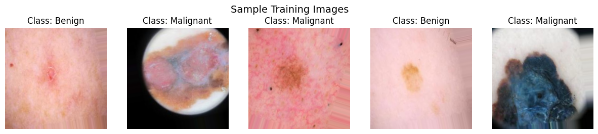

### **Validation Data Samples**

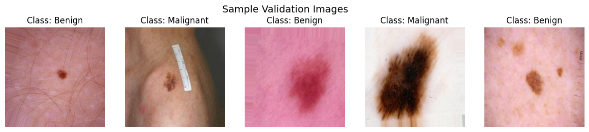

### **Test Data Samples**

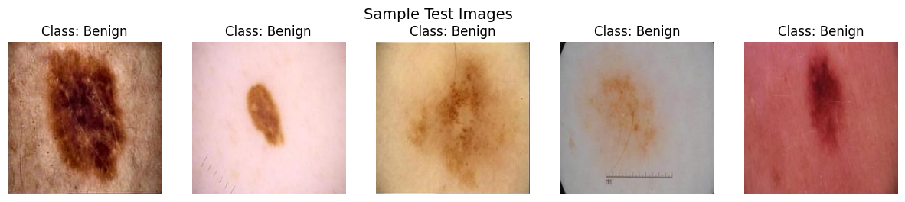

## Model Training & Evaluation
-----
### **Baseline Model**
The baseline CNN was trained as a reference.

- **Training Progress**
  
  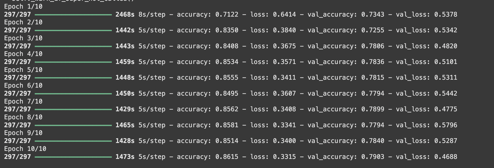

- **Classification Report**
  
  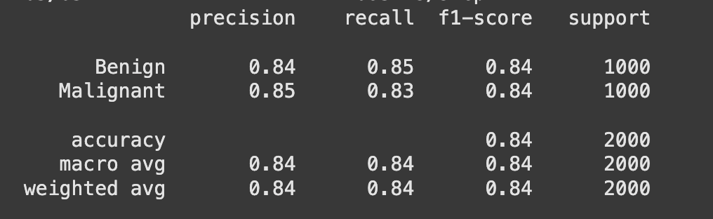

- **Confusion Matrix**
  
  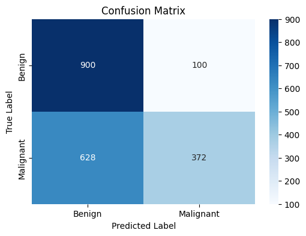

- **Sample Predictions**
  
  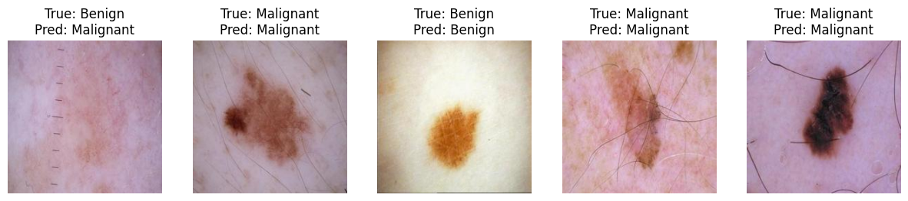

### **Transfer Learning Models**

I fine-tuned **EfficientNetB0, MobileNetV2, and ResNet50** for performance improvement.
-----
#### **EfficientNet**
- **Training Progress**
  
  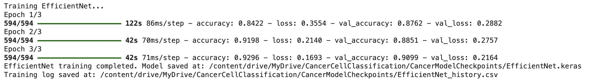

- **Classification Report**
  
  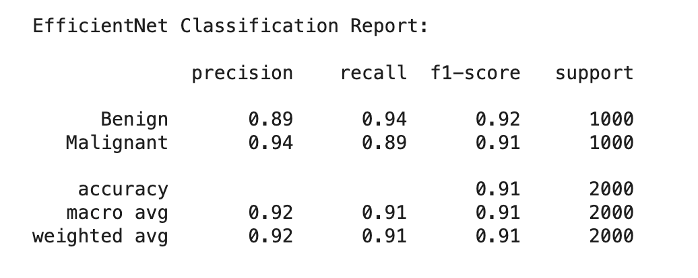

- **Confusion Matrix**
  
  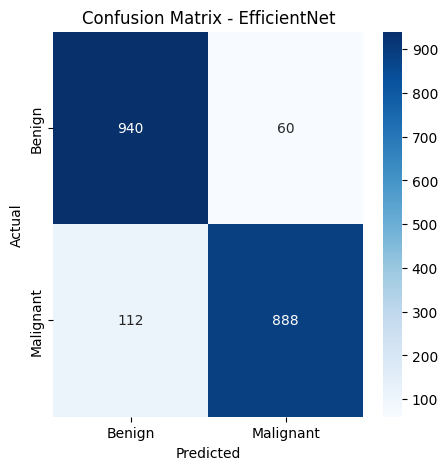

- **Sample Predictions**
  
  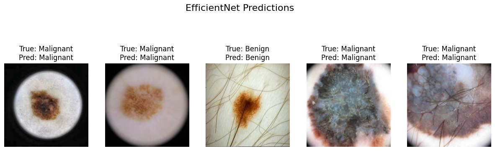

-----
#### **MobileNet**
- **Training Progress**
  
  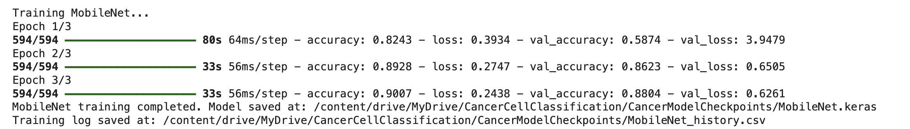

- **Classification Report**
  
  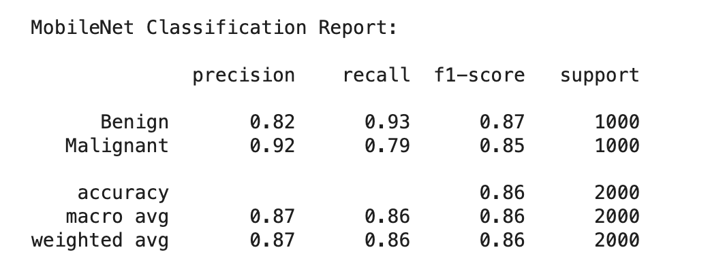

- **Confusion Matrix**
  
  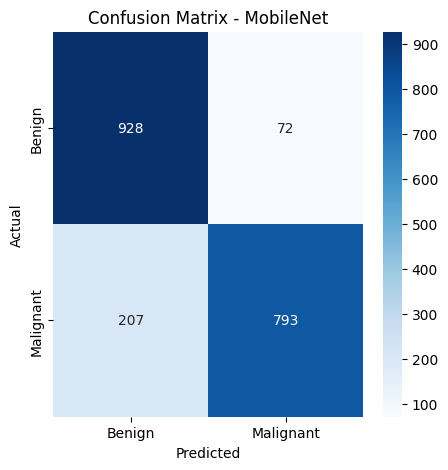

- **Sample Predictions**
  
  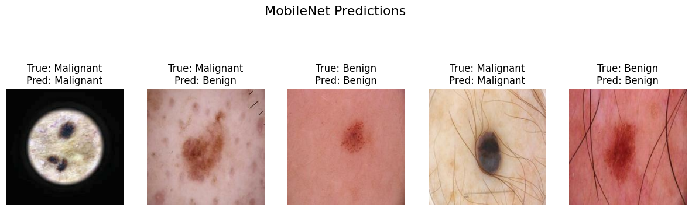

-----
#### **ResNet**
- **Training Progress**
  
  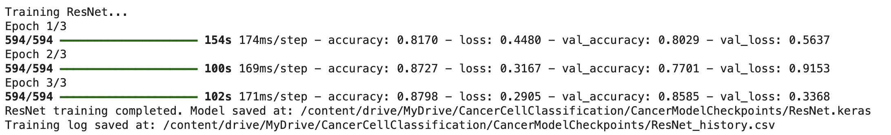

- **Classification Report**
  
  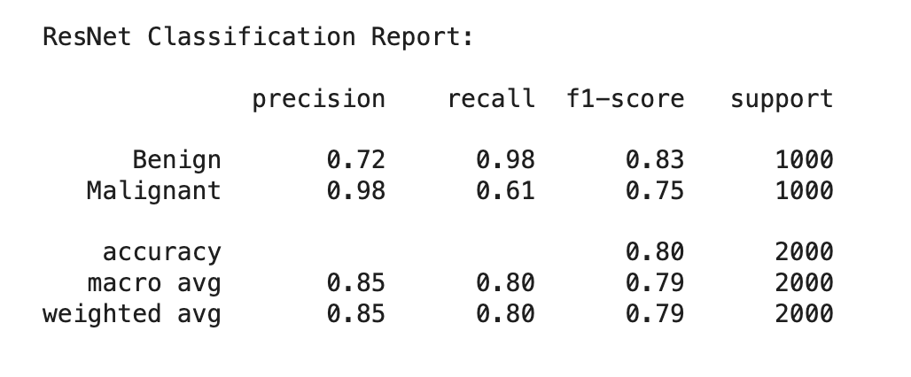

- **Confusion Matrix**
  
  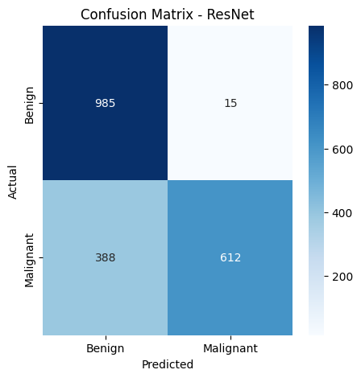

- **Sample Predictions**
  
  

-----
### **Model Comparison**
To compare the models, I analyzed ROC curves and classification metrics.

- **ROC Curve**
  
  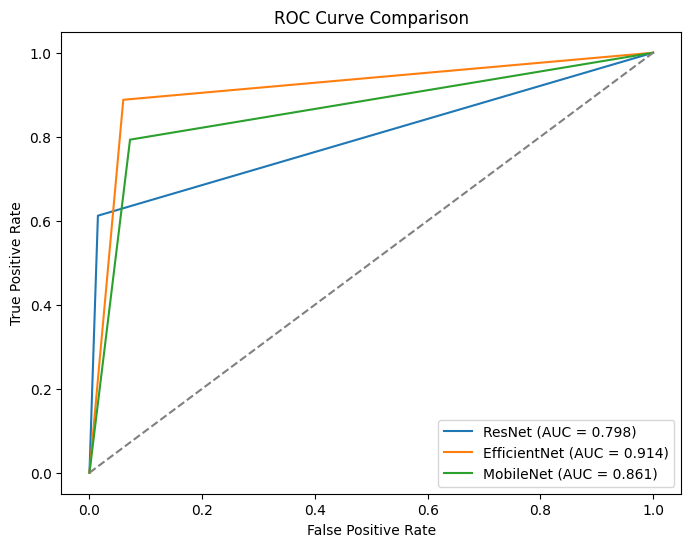

## Conclusion

- **EfficientNetB0** provided the best balance betIen accuracy, recall, and computational efficiency.
- **MobileNetV2** delivered competitive performance with loIr resource requirements.
- **ResNet50** shoId high precision but loIr recall, indicating a tendency to misclassify malignant cases.

This project demonstrates how deep learning can be effectively utilized in **medical image classification**. The structured pipeline ensures reproducibility and can be extended to other classification tasks.
